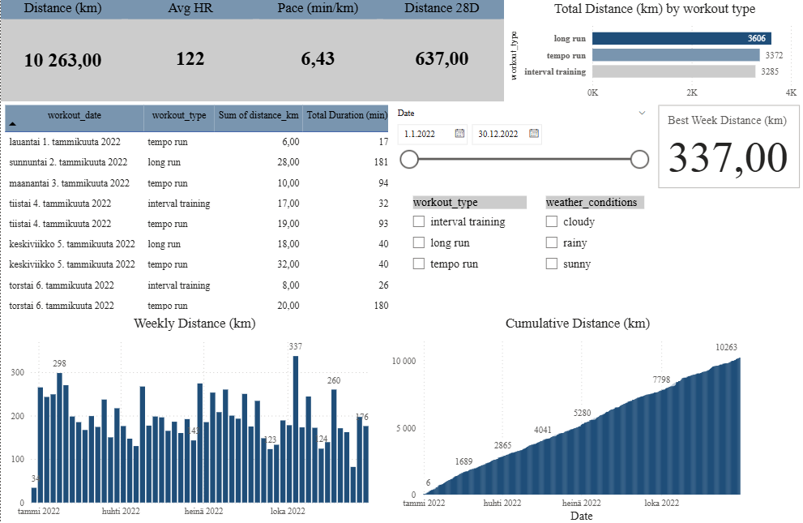

# Running Dashboard in Power BI

Dashboard built from random AI created workouts (2022).  

## Features
- **KPI cards**: Total Distance, Avg Heart Rate, Avg Pace, 28D Rolling Distance, Best Week
- **Trends**: Weekly distance and cumulative distance over time
- **Breakdowns**: Distance by workout type, weather conditions
- **Detail table**: Raw workouts (date, type, distance, duration, pace, HR)

## Tools & Methods
- Power BI, Power Query for cleaning (datatypes, locale handling)
- DAX measures for calculations (e.g. cumulative distance, rolling 28-day totals)

## Screenshots
  
  
  

running data made with AI (https://www.mockaroo.com/)
---
